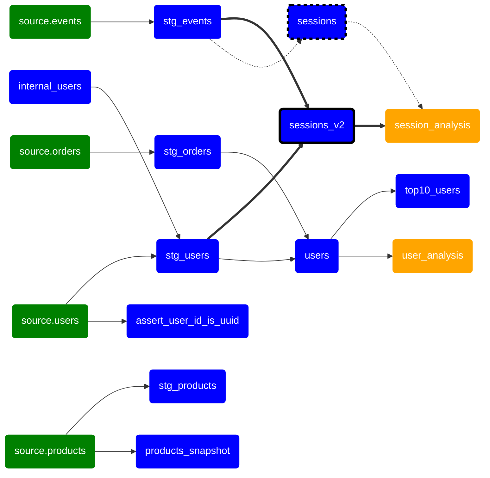

# dbt-mermaid

This action draws lineage graph of your dbt project as [mermaid](https://mermaid.js.org/) flowchart.

## Usage

See [action.yml](action.yml) for details.

## Examples

- Save entire lineage graph as artifacts on push ([yml](.github/workflows/demo_on_push.yml)).

- Visualize modified models and its parents/children on pull requests ([yml](.github/workflows/demo_on_pull_request.yml)).

## Feedback

If you find any bugs, please feel free to create an issue.
